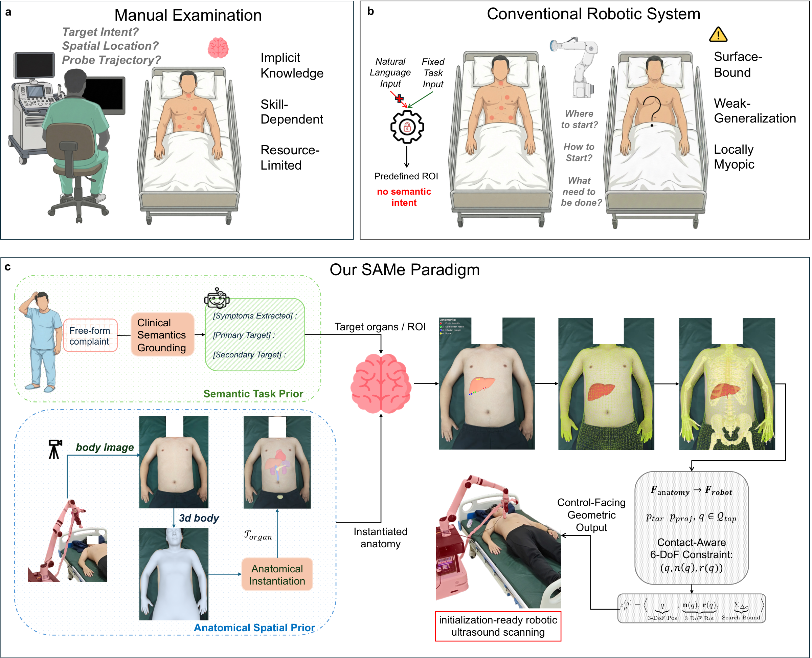
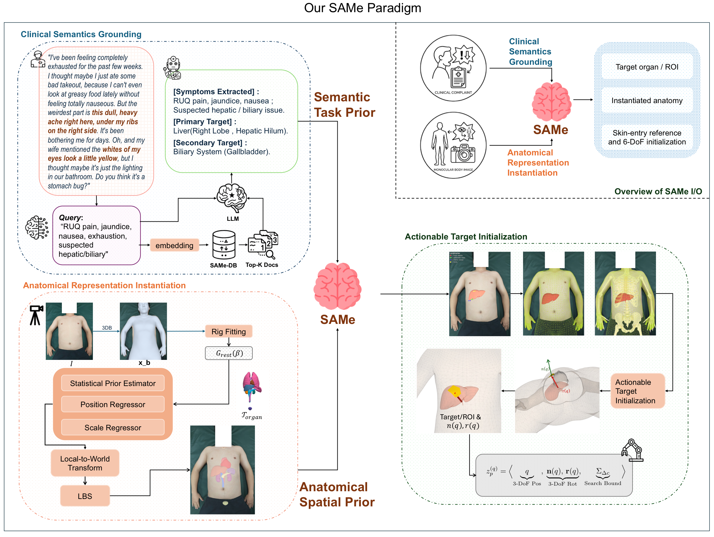
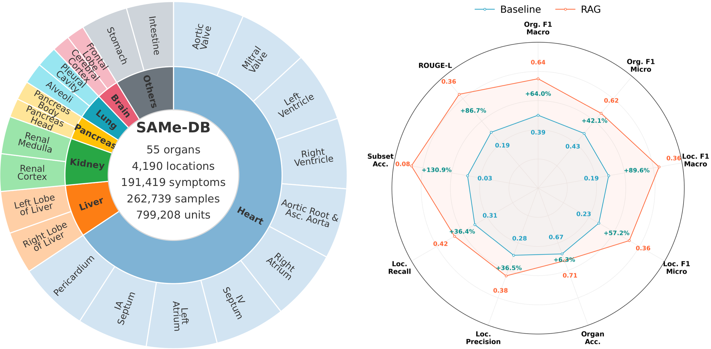
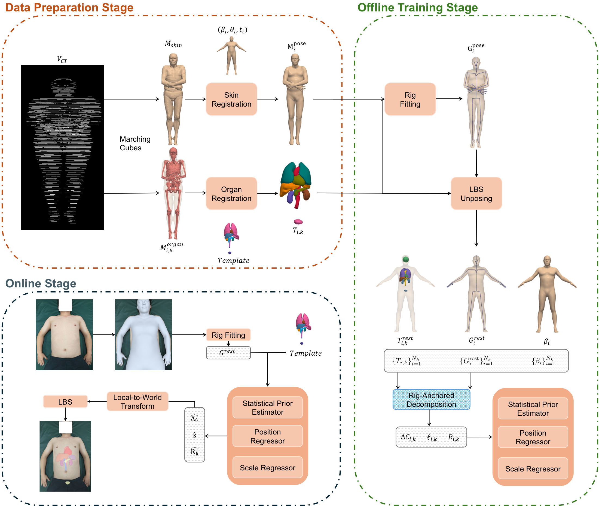

<div align="center">

<h2 align="center"><strong>SAMe: A Semantic Anatomy Mapping Engine for Robotic Ultrasound</strong></h2>

<div align="center">
<h5>
<em>Jing Zhang<sup>1,*,†</sup>, Duojie Chen<sup>1,2,*</sup>, Wentao Jiang<sup>1</sup>, Zihan Lou<sup>1</sup>, Jianxin Liu<sup>3</sup>, Xinwu Cui<sup>4</sup>, Qinghong Zhao<sup>5</sup>, Bo Du<sup>1,†</sup>, Christoph F. Dietrich<sup>6</sup>, Dacheng Tao<sup>7,†</sup></em>
    <br><br>
        <sup>1</sup> School of Computer Science, Wuhan University, China,<br/>
        <sup>2</sup> Hubei Center for Applied Mathematics, Wuhan University, China,<br/>
        <sup>3</sup> Department of Ultrasound, The Central Hospital of Wuhan, China,<br/>
        <sup>4</sup> Department of Medical Ultrasound, Tongji Hospital, Tongji Medical College, Huazhong University of Science and Technology, China,<br/>
        <sup>5</sup> Department of Ultrasound in Medicine, Renmin Hospital of Wuhan University, China,<br/>
        <sup>6</sup> Department General Internal Medicine (DAIM), Hospitals Hirslanden Bern Beau Site, Salem and Permanence, Bern, Switzerland,<br/>
        <sup>7</sup> College of Computing and Data Science, Nanyang Technological University, Singapore<br/>
</h5>
<h5>
<sup>*</sup> Equal contribution, <sup>†</sup> Corresponding author
</h5>
</div>

<h5 align="center">
<a href=""></a>
<a href="https://arxiv.org/abs/2604.25646"></a>
<a href="LICENSE"></a>
<a href="https://www.python.org/"></a>
</h5>

**A plug-in anatomical prior layer that grounds clinical intent and a single external body image into patient-specific anatomical hypotheses and control-facing 6-DoF probe initialization cues.**

[Introduction](#-introduction) | [Key Features](#-key-features) | [Method Overview](#-method-overview) | [Clinical Semantics Grounding (CSG)](#-clinical-semantics-grounding-csg) | [Anatomical Representation Instantiation (ARI)](#-anatomical-representation-instantiation-ari) | [Actionable Target Initialization (ATI)](#-actionable-target-initialization-ati) | [Main Results](#-main-results) | [Getting Started](#-getting-started) | [Release Status](#-release-status) | [Citation](#-citation)

</div>

---

## 📅 Release Status

**2026.04**
* Repository structure and overview materials published.
* Manuscript under review.

---

## 📖 Introduction

Robotic ultrasound has made substantial progress in local image-driven control, contact regulation, and view optimization. However, current systems still lack an explicit anatomical prior layer for deciding **what to scan, where to start, and how to place the probe before local refinement begins**.

**SAMe** bridges this gap as a **target-to-anatomy-to-action** framework for anatomy-aware scan initialization. It provides a plug-in prior layer that grounds clinical intent into structured anatomical targets, instantiates patient-specific anatomy from a single external body image, and converts the result into robot-readable, contact-aware 6-DoF initialization cues — without preoperative CT/MRI or additional registration sweeps.

<div align="center">
  
  <p><em>From manual expertise and surface-bound robotic pipelines to the SAMe prior-layer paradigm.</em></p>
</div>

---

## 🚀 Highlights

* **🧠 Structured Anatomy Mapping:** Decomposed into **3** coupled modules (CSG → ARI → ATI) spanning complaint grounding to probe initialization.
* **📷 Single RGB Input:** One monocular external body image — no preoperative CT/MRI and no additional registration sweep at scan time.
* **⚡ Lightweight Inference:** Full-organ prior inference in **0.76 s** on CPU; liver-only in **0.08 s**.
* **🤖 Real-Robot Validation:** **97.3%** organ-hit rate for liver and **81.7%** for kidney initialization on physical platform.

### At a Glance

| Item | Description |
| :--- | :--- |
| **Input** | Clinical complaint + single monocular RGB body image |
| **Core Output** | Grounded organ/ROI, patient-specific anatomical hypothesis, control-facing 6-DoF initialization cues |
| **Design Goal** | Anatomy-aware scan initialization before local image-based refinement |
| **No Extra Acquisition** | No CT/MRI; no registration sweep |
| **Inference Cost** | **0.76 s** (full organ set, CPU) / **0.08 s** (liver only, CPU) |
| **Real-Robot Hit Rate** | **97.3%** liver / **81.7%** kidney |

---

## 🧠 Method Overview

SAMe is organized into three coupled components that form a **target-to-anatomy-to-action** pipeline:

<div align="center">
  
  <p><em>Overview of the SAMe pipeline from semantic grounding to anatomical instantiation and robot-facing initialization.</em></p>
</div>

| Module | Core Question | Input | Output | Key Capability |
| :--- | :--- | :--- | :--- | :--- |
| **CSG** | What should be scanned? | Complaint text | Organ- and anatomy-level targets | Clinical semantics grounding via retrieval-augmented prior |
| **ARI** | Where is the target anatomy? | Single RGB body image | Patient-specific anatomical hypothesis | Skeleton-conditioned organ instantiation with uncertainty |
| **ATI** | How should scanning begin? | Anatomical hypothesis | Candidate contacts, target rays, 6-DoF probe states | Contact-aware initialization for downstream control |

SAMe is **not** a full autonomous scanning system. It is an explicit anatomical prior layer designed to improve initialization and remain compatible with downstream control.

---

## 🔍 Clinical Semantics Grounding (CSG)

CSG grounds under-specified clinical complaints into explicit organ- and anatomy-level targets via a structured semantic prior.

<div align="center">
  
  <p><em>Semantic prior database and retrieval-augmented grounding performance.</em></p>
</div>

---

## 🏗️ Anatomical Representation Instantiation (ARI)

ARI instantiates a patient-specific anatomical representation from a single RGB body image through skeleton-conditioned organ placement with uncertainty estimation.

<div align="center">
  
  <p><em>Offline organ-layer modeling and rig-anchored prior learning used to support patient-specific anatomical instantiation.</em></p>
</div>

---

## 🎯 Actionable Target Initialization (ATI)

ATI converts internal target hypotheses into candidate surface contacts, target-directed entry rays, and contact-aware 6-DoF probe initialization states for downstream robotic execution.

<div align="center">
  
  <p><em>Representative real-robot setup and anatomy-aware liver target placement used in the study.</em></p>
</div>

---

## 🏆 Main Results

### Comparison with Existing Robotic Ultrasound Systems

| System / Approach | Anatomical Prior | Input Modality | Online Initialization | Complaint-Driven |
| :--- | :---: | :--- | :---: | :---: |
| Surface-heuristic baselines | ❌ | RGB / none | ⚠️ Heuristic | ❌ |
| CT/MRI-registered methods | ✅ Volumetric | Preoperative CT/MRI | ✅ | ❌ |
| Image-based controllers | ❌ | Ultrasound B-mode | ✅ | ❌ |
| **SAMe (Ours)** | **✅ Skeleton-conditioned** | **Single RGB** | **✅** | **✅** |

### Quantitative Results

| Component | Evaluation Setting | Key Result |
| :--- | :--- | :--- |
| **CSG** | 1,000 held-out symptom descriptions | Location-level F1: **0.357** (macro) / **0.356** (micro) with SAMe-DB |
| **ARI** | 35 held-out cases, 11 organs, 385 pairs | Mean centroid error: **22.55 mm**; support IoU: **0.391** |
| **ARI Efficiency** | CPU inference | Full-organ: **0.76 s**; liver-only: **0.08 s** |
| **ATI** | Real-robot ultrasound | Organ-hit rate: **97.3%** (liver) / **81.7%** (kidney) |

Additional findings include:
* Centroid-based SAMe initialization outperformed surface-heuristic baselines for both liver and kidney.
* The explicit low-dimensional representation improved point localization, organ support estimation, and downstream initialization usability.
* The formulation preserved robustness across substantial body-habitus variation while remaining lightweight enough for deployment.

---

## 🚀 Getting Started

Coming soon...

---

## 🖊️ Citation

If you find **SAMe** useful for your research, please cite:

```bibtex
@misc{same2026,
  title={SAMe: A Semantic Anatomy Mapping Engine for Robotic Ultrasound},
  author={Jing Zhang and Duojie Chen and Wentao Jiang and Zihan Lou and Jianxin Liu and Xinwu Cui and Qinghong Zhao and Bo Du and Christoph F. Dietrich and Dacheng Tao},
  year={2026},
  note={Under review}
}
```

---

<div align="center">
<p>Maintained by the Echo-SAMe Team</p>
</div>
